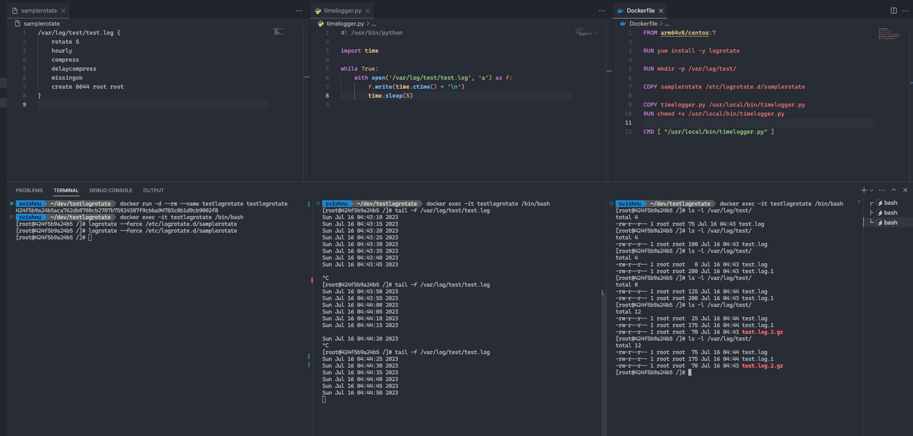

# Test Logrotate

This script show how logrotate works and how it affects the program that is writing to the log file.

### Files

1. `samplerotate`: This is the script that will be run by logrotate. It rotates the log file
2. `timerlogger.py`: This is the script that runs in an infinite loop and writes the current time to the log file `/var/log/test/test.log`
3. `Dockerfile`: Dockerfile to build the image

### Build

```
docker build -t testlogrotate .
```

### Run

```
docker run -d --rm --name testlogrotate testlogrotate
```

### Check

```
docker exec -it testlogrotate bash
tail -f /var/log/test/test.log
```

### Logrotate

```
docker exec -it testlogrotate bash
logrotate -f /etc/logrotate.d/samplerotate
```

### Screenshot of the run



### References
1. [logrotate(8) - Linux man page](https://linux.die.net/man/8/logrotate)
2. [logrotate cheatsheet](https://www.ullright.org/ullWiki/show/logrotate-cheatsheet)
